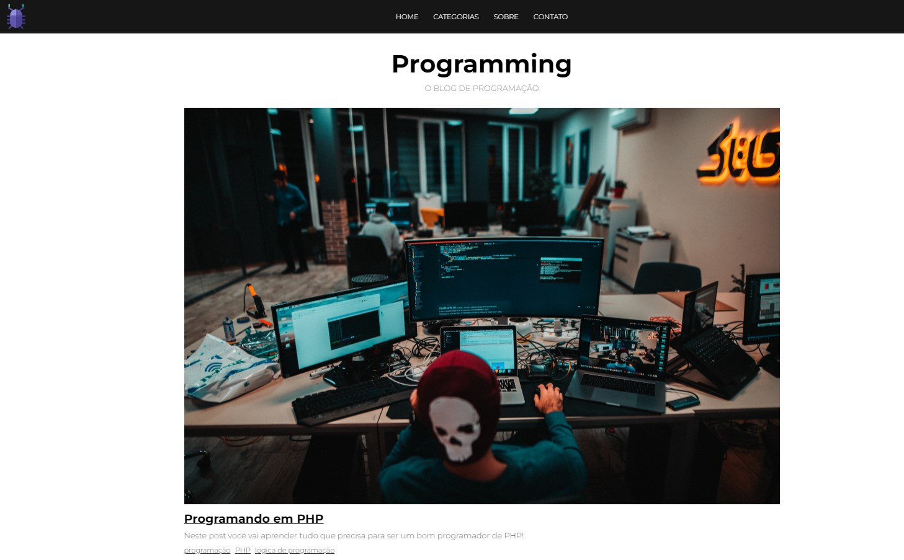

<h1 align="center">
<p ><b>Blog <b style="text-decoration: none; color: purple">Programming</b>🧑🏽‍💻🖥️<b></p>


<br>
</h1>


<a href="https://blog-programming.000webhostapp.com//" style="text-decoration: none; color: purple; font-size: 25px; ">
  🟣 Clique aqui para explorar o site!
</a>


## 📔 Sobre

- Este site é um blog de programação que utiliza HTML, CSS e PHP para sua estrutura e funcionalidades. A página inicial apresenta uma lista de postagens com títulos, descrições e tags, onde os usuários podem clicar para ler mais sobre cada postagem. O layout responsivo garante uma boa experiência de navegação em dispositivos móveis.

- O PHP é utilizado para criar páginas dinâmicas, como a página de contato e as postagens individuais. Ele interage com os arquivos de dados PHP para recuperar informações sobre as postagens e categorias, que são então exibidas dinamicamente na página. O PHP também é responsável por incluir os cabeçalhos e rodapés em todas as páginas do site, garantindo consistência visual.

- Por fim, o site faz uso de algumas bibliotecas externas, como Font Awesome para ícones e jQuery para funcionalidades JavaScript adicionais, como transições suaves e interações de usuário. 


## 🔨 Ferramentas

- [HTML5](https://www.w3schools.com/html/)
- [CSS3](https://www.w3schools.com/css/)
- [PHP](https://www.w3schools.com/php/)


## ♻️ Como contribuir para este projeto

```bash
# Clone o projeto
$ git clone https://github.com/rafaelbcabral/catalogo-ajax.git
````
<br>

````bash
# Entrar no diretório
$ cd catalogo-ajax
````
<br>

````bash
# Instalar as dependencias, caso use npm
$ npm install
````

<p style="text-align: center; font-size: 15px; "><b>OR</b></p>

````bash
# Caso use Yarn
$ yarn
````

<h1></h1>
<p style="text-align: center; font-weight: bold; font-size: 20px">End</p>